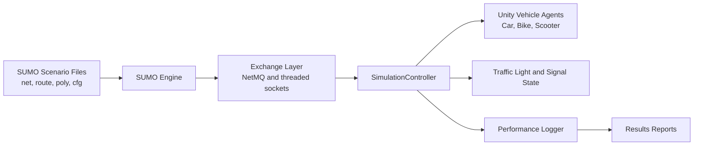
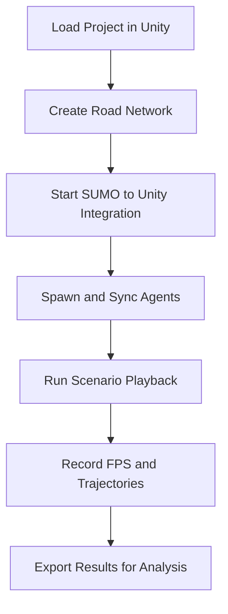

# SUMO2Unity: Car-Bike-Cycle Simulator

A professional co-simulation environment that integrates SUMO traffic simulation with Unity-based 3D runtime visualization for mixed vehicle studies.

## Project Purpose

This simulator is designed for:
- import and reconstruction of road networks in Unity,
- real-time synchronization of vehicle state between SUMO and Unity,
- logging of runtime metrics and trajectories for analysis.

## High-Level Architecture



## Operational Flow



## Implemented Modules

### 1. Scenario and Configuration Package

Scenario artifacts are available in `scenario1/`, including:
- `Sumo2Unity.net.xml`
- `Sumo2Unity.rou.xml`
- `Sumo2Unity.Poly.xml`
- `Sumo2Unity.sumocfg`
- `Sumo2Unity.netecfg`

### 2. Road Network Builder

Core scripts are located in `Assets/_Project/Scripts/RoadNetworkScripts/`.

Unity editor menu pipeline:
- `Sumo2Unity/1. Create Road Network`
- `Sumo2Unity/2. Run Sumo2Unity Integration`
- `Sumo2Unity/3. Performance Functions`

### 3. Runtime Integration Layer

Integration scripts are located in `Assets/_Project/Scripts/IntegrationScripts/`.

Key responsibilities:
- bidirectional SUMO-Unity message exchange,
- vehicle lifecycle synchronization,
- traffic signal state handling.

### 4. Vehicle Agent Systems

Vehicle control scripts and assets are available under `Assets/_Project/Vehicles/`.

Current controllable classes:
- Ego car
- Bike
- Scooter

### 5. Analytics and Reporting

Generated outputs are written to `Results/`:
- `FPS_Report.txt`
- `vehicle_data_report.txt`
- `rtf_report.txt`

## Quick Start

1. Install SUMO (recommended baseline used in this project: 1.26.x).
2. Install Unity Hub and open with Unity Editor `6000.0.53f1`.
3. Execute Unity menu actions in order:
   - `Sumo2Unity/1. Create Road Network`
   - `Sumo2Unity/2. Run Sumo2Unity Integration`
   - `Sumo2Unity/3. Performance Functions`
4. Run the simulation and inspect `Results/` outputs.

## Repository Structure

```text
Car-Bike-Cycle-simulator/
  Assets/_Project/
    Scripts/
      RoadNetworkScripts/
      IntegrationScripts/
    Vehicles/
  scenario1/
  Results/
  RequiredFiles/
```

## Known Scope Boundaries

- This project currently targets vehicle-centric scenarios.
- Pedestrian external modeling is maintained in the separate pedestrian simulator workspace.

## Media and Tutorials

- Driver demo: https://youtu.be/im94-gCvA1E
- Bicycle demo: https://youtu.be/-irVV5CndfI
- 3D visualization demo: https://youtu.be/AnrVQ6WHWJg
- Additional demo: https://www.youtube.com/watch?v=9nSCKIz6lQI
- SUMO tutorial: https://youtu.be/IwsrNWlX9Ag?si=ui75deOeqbreQTf7
- Unity tutorial: https://youtu.be/ngccSGH3-_8?si=X1Lx07NUWUqOvJ2f
- SUMO2Unity tutorial: https://youtu.be/Cv1wBGuaT0E

## Citation

If you use SUMO2Unity in academic work, please cite:

- Mohammadi, A., Park, P. Y., Nourinejad, M., Cherakkatil, M. S. B., and Park, H. S. (2024). SUMO2Unity: An Open-Source Traffic Co-Simulation Tool to Improve Road Safety. IEEE Intelligent Vehicles Symposium.
- Mohammadi, A., Cherakkatil, M. S. B., Park, P. Y., Nourinejad, M., and Asgary, A. (2025). An Open-Source Virtual Reality Traffic Co-Simulation for Enhanced Traffic Safety Assessment. Applied Sciences, 15(17), 9351.

## License

- Code: MIT
- Assets: CC-BY

