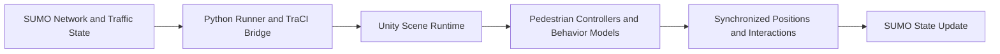
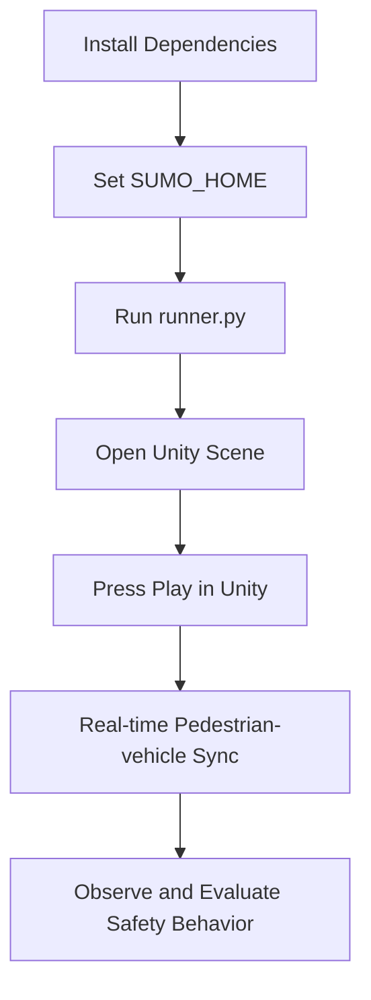

# Pedestrian Simulator for SUMO-Unity Co-Simulation

An external pedestrian modeling framework that keeps SUMO traffic dynamics while running pedestrian behavior logic in Unity.

## Project Goal

This project enables pedestrian safety research by:
- mirroring the SUMO environment in Unity,
- simulating pedestrian behavior externally (including Social Force variants),
- synchronizing pedestrian and vehicle interactions back into SUMO.

## Architecture Overview



## Runtime Flowchart



## Prerequisites

1. SUMO installed on Windows.
2. Python environment with required packages.
3. Unity Editor (recommended for this project baseline: `2019.2.10f1`).

SUMO installation reference:
- https://sumo.dlr.de/docs/Installing/Windows_Build.html

## Setup

### 1. Install Python dependencies

From repository root:

```powershell
pip install -r ".\SUMO Network\requirements.txt"
```

### 2. Configure SUMO path in terminal

```powershell
$env:SUMO_HOME = "C:\Program Files (x86)\Eclipse\Sumo"
```

Adjust the path if SUMO is installed in a different location.

## Running the Simulator

### 1. Start SUMO bridge

```powershell
python ".\SUMO Network\runner.py"
```

Optional headless mode:

```powershell
python ".\SUMO Network\runner.py" --nogui
```

When SUMO GUI opens, press Play or `Ctrl + A`.

### 2. Open and run Unity scene

Open the Unity project and load:
- `SSASC - SUMO Unity Scene/Assets/Scenes/Sumo Perfect Backup.unity`

Press Play to start synchronized simulation.

## Camera and View Configuration

If the scene starts in top-view mode, use this checklist:

1. Ensure `Sumo Perfect Backup` scene is loaded.
2. Confirm `[VRTK_SDKManager]` exists and is active.
3. Disable additional overview cameras outside the VRTK rig.
4. Keep one active gameplay camera tagged `MainCamera`.
5. Verify `SubjectController` is enabled for the player object.
6. Set camera rig head height around `Y = 1.6` to `1.8`.

## Keyboard Fallback Controls (No VR Headset)

Desktop test controls:
- `W` / `S`: move forward and backward
- `A` / `D`: strafe left and right
- `Q` / `E` or Left/Right arrows: rotate view

The camera is automatically placed at pedestrian eye height when VR tracking is unavailable.

## Stop Running Bridge Process

```powershell
$targets = Get-CimInstance Win32_Process | Where-Object { $_.Name -match '^python(\.exe)?$' -and $_.CommandLine -like '*SUMO Network\runner.py*' }
if ($targets) {
	$targets | ForEach-Object { Stop-Process -Id $_.ProcessId -Force }
	"Stopped runner.py process IDs: $($targets.ProcessId -join ', ')"
} else {
	'No running runner.py process found.'
}
```

## Repository Layout

```text
Pedestrian-simulator/
	SUMO Network/
		runner.py
		requirements.txt
	SSASC - SUMO Unity Scene/
		Assets/
			Scenes/
```

