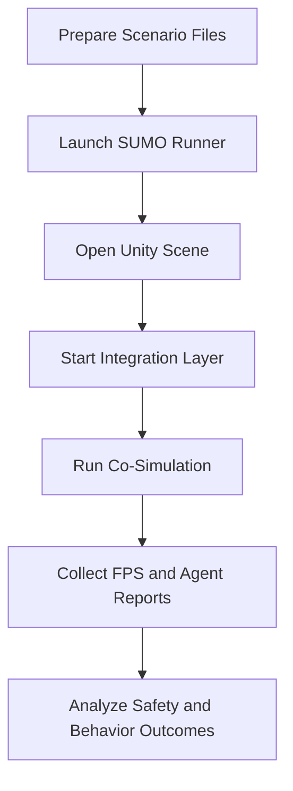

# SUMO2Unity Workspace

A unified workspace for traffic co-simulation research using SUMO and Unity.

This repository includes three complementary simulators:
- Car-Bike-Cycle simulator for mixed vehicle traffic synchronization and performance analytics.
- Pedestrian simulator for externally modeled pedestrian dynamics mirrored in SUMO.
- Pedestrian-VR simulator for immersive pedestrian and traffic safety studies in VR.

## Workspace Components

| Component | Path | Primary Purpose |
|---|---|---|
| Car-Bike-Cycle simulator | ./Car-Bike-Cycle-simulator | Vehicle-centric co-simulation, road import, runtime synchronization, metrics export |
| Pedestrian simulator | ./Pedestrian-simulator | Pedestrian behavior modeling in Unity with SUMO state synchronization |
| Pedestrian-VR simulator | ./Pedestrian-VR-simulator | VR-based pedestrian co-simulation and headset-oriented runtime setup |

## System Architecture

## End-to-End Workflow

## Quick Navigation

- Main Unity solution (vehicle simulator): ./Car-Bike-Cycle-simulator/SUMO2Unity.sln
- Pedestrian SUMO runner: ./Pedestrian-simulator/SUMO Network/runner.py
- Vehicle scenario package: ./Car-Bike-Cycle-simulator/scenario1
- Project READMEs:
	- ./Car-Bike-Cycle-simulator/README.md
	- ./Pedestrian-simulator/README.md
	- ./Pedestrian-VR-simulator/README.md
	- ./Pedestrian-VR-simulator/README_VR_SETUP.md

## Practical Notes

- Generated or cached directories (for example `Library`, `Temp`, `obj`, `venv`, `.venv`) should not be used as authoritative documentation sources.
- Use the project-level READMEs as the source of truth for setup, execution, and troubleshooting.
